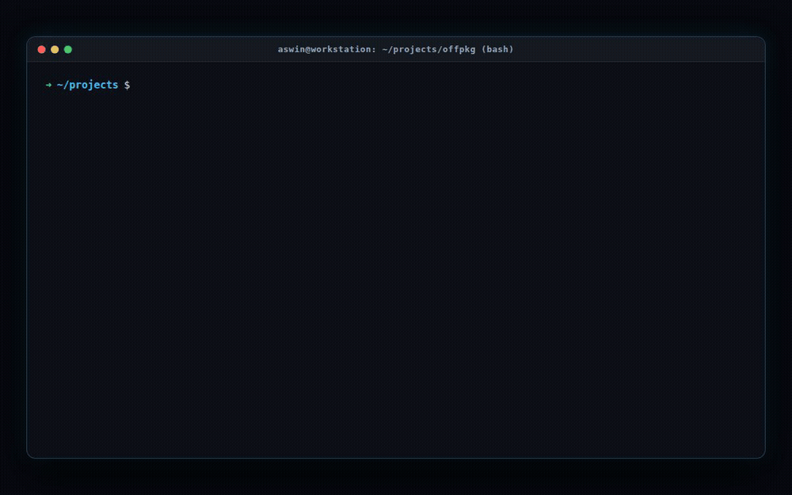

<p align="center">
  <a href="https://github.com/aswin402/offpkg">
    
  </a>
</p>

<div align="center">

**High-performance, offline-first package manager & fullstack template engine.**  
Cache packages once from **npm (Bun)**, **PyPI (uv)**, and **pub.dev (Flutter)**. Instantiate instantly offline forever.

<br/>

[](https://github.com/aswin402/offpkg/releases)
[](https://www.rust-lang.org/)
[](LICENSE)
[](https://github.com/aswin402/offpkg/releases)
[](https://github.com/aswin402/offpkg/releases/latest)

</div>

<p align="center">
  
</p>

---

## At a Glance ⚡

| Dimension | Details |
| :--- | :--- |
| **Problem** | Developers face broken installs, stalled CI, or failed scaffolds when working on trains, flights, remote sites, or air-gapped environments. Standard package managers force redundant network round-trips. |
| **Solution** | `offpkg` fetches packages once, verifies cryptographic hashes, catalogs them in a high-speed SQLite database, and instantiates them globally offline in milliseconds. |
| **Under the Hood** | Written in **100% pure Rust** with **Tokio** (async runtime), **SQLite** (bundled engine), **reqwest** (`rustls-tls` zero-OpenSSL dependency), and **SHA-256** checksum verification. |
| **Supported Ecosystems** | **Bun** (npm / Node.js) · **uv** (PyPI / Python) · **Flutter** (pub.dev / Dart). |
| **Binary Profile** | Self-contained, stripped static binary (**~8.2 MB**). No external runtime, interpreter, or dynamic libraries needed. |

---

## Performance & Resource Footprint 📊

`offpkg` is engineered with resource discipline for ultra-fast startup and minimal system overhead:

| Resource / Metric | Benchmark Value | Engineering Details |
| :--- | :--- | :--- |
| **ROM Footprint (Binary)** | **~8.2 MB** | Single compiled, stripped release binary. Zero external runtime dependencies. |
| **Resident Memory (RAM)** | **~7.3 MB** | Peak memory during SQLite catalog queries and deep configuration parsing. |
| **CLI Dispatch Latency** | **< 15 ms** | Sub-millisecond argument parsing via `clap` and instant local cache discovery. |
| **Offline Linking Speed** | **Instant (ms)** | Zero network calls; fast local archive extraction directly into project targets. |

---

## How It Works 🔄

> 🎬 **Watch the 30-Second Overview:** [High-Quality Explanatory Video (`assets/how-it-works.mp4`)](assets/how-it-works.mp4)

<p align="center">
  <video src="https://raw.githubusercontent.com/aswin402/offpkg/main/assets/how-it-works.mp4" controls="controls" width="100%" style="max-width: 900px; border-radius: 12px; box-shadow: 0 20px 50px rgba(0,0,0,0.5);">
    <a href="assets/how-it-works.mp4">▶ Play Video: How offpkg Works (1080p Full HD)</a>
  </video>
</p>

```
ONLINE (Run Once):                                  OFFLINE (Forever):
─────────────────────────────────────────────       ──────────────────────────────────────────────
$ offpkg bun install react                   →      $ offpkg bun add react          (Project A)
$ offpkg uv install fastapi                  →      $ offpkg uv add fastapi         (Project B)
$ offpkg flutter install dio                 →      $ offpkg flutter add dio        (Project C)
$ offpkg stack install react-vite            →      $ offpkg stack add react-vite   (Zero network)
$ offpkg docs edit react                     →      $ (Auto-copied to offpkg_docs/ in every repo)
```

---

## Quickstart & Installation 🚀

Choose the installation method suited for your environment:

### 1. Linux & macOS (Automated One-Liner)

Detects OS, downloads the pre-built binary, installs to `~/.offpkg/bin`, and updates your shell `$PATH`:

```bash
# Using curl
curl -fsSL https://raw.githubusercontent.com/aswin402/offpkg/main/install.sh | bash

# Or using wget
wget -qO- https://raw.githubusercontent.com/aswin402/offpkg/main/install.sh | bash
```

Reload your terminal session:
```bash
source ~/.bashrc   # or ~/.zshrc / source ~/.config/fish/config.fish
```

---

### 2. Windows (PowerShell One-Liner)

Open **PowerShell** or Windows Terminal and run:

```powershell
irm https://raw.githubusercontent.com/aswin402/offpkg/main/install.ps1 | iex
```

*Downloads `offpkg.exe`, saves to `%USERPROFILE%\.offpkg\bin`, and registers the directory in your User `PATH` environment variable permanently.*

---

### 3. Install with Bun or npm 🍞

If you already use **Bun** or **Node.js**, install globally or invoke on-demand:

```bash
# Install globally with Bun
bun add -g github:aswin402/offpkg

# Or run instantly without installing via bunx
bunx github:aswin402/offpkg doctor
bunx github:aswin402/offpkg stack list

# Or install globally via npm
npm install -g github:aswin402/offpkg

# Or run ephemerally with npx
npx github:aswin402/offpkg doctor
```

---

### 4. Install with Python / uv 🐍

If you already use **uv** or Python, install `offpkg` into an isolated tool environment:

```bash
# Install globally via uv tool
uv tool install git+https://github.com/aswin402/offpkg.git

# Or run ephemerally with uvx
uvx --from git+https://github.com/aswin402/offpkg.git offpkg doctor
uvx --from git+https://github.com/aswin402/offpkg.git offpkg stack list
```

---

### 5. Pre-Built Static Binaries (GitHub Releases)

Download standalone binaries directly from [GitHub Releases](https://github.com/aswin402/offpkg/releases/latest):

| Platform | Architecture | Binary Download |
|---|---|---|
| **Linux** | `x86_64` (Intel / AMD) | [`offpkg-linux-x86_64`](https://github.com/aswin402/offpkg/releases/latest/download/offpkg-linux-x86_64) |
| **Linux** | `aarch64` (ARM64) | [`offpkg-linux-aarch64`](https://github.com/aswin402/offpkg/releases/latest/download/offpkg-linux-aarch64) |
| **macOS** | `Apple Silicon` (M1/M2/M3/M4) | [`offpkg-macos-aarch64`](https://github.com/aswin402/offpkg/releases/latest/download/offpkg-macos-aarch64) |
| **macOS** | `x86_64` (Intel) | [`offpkg-macos-x86_64`](https://github.com/aswin402/offpkg/releases/latest/download/offpkg-macos-x86_64) |
| **Windows** | `x86_64` | [`offpkg-windows-x86_64.exe`](https://github.com/aswin402/offpkg/releases/latest/download/offpkg-windows-x86_64.exe) |

```bash
# Quick manual setup (Linux / macOS)
curl -sL -o offpkg https://github.com/aswin402/offpkg/releases/latest/download/offpkg-linux-x86_64
chmod +x offpkg
sudo mv offpkg /usr/local/bin/
```

---

### 6. Install via Cargo (Rust)

If you have Rust 1.80+ installed:

```bash
cargo install --git https://github.com/aswin402/offpkg.git
```

---

## Automated Self-Updating 🔄

Keep `offpkg` updated with the latest templates and improvements using a single command:

```bash
# Checks GitHub releases and updates binary in-place
offpkg update self

# Or via alias
offpkg self-update
```

If your installation is already current:
```
[ info    ]  checking for offpkg updates...
[ done    ]  offpkg is already up to date (v0.1.7)
```

---

## Core Features ✨

- **📦 Multi-Runtime Support**: Unifies package caching for Bun (`npm`), Python (`uv`/`PyPI`), and Flutter (`pub.dev`).
- **🔒 Cryptographic Integrity**: Verifies SHA-256 hashes on all cached `.tgz`, `.whl`, and `.tar.gz` archives in `~/.offpkg/cache/`.
- **🗃️ SQLite Database Manifest**: Embedded `offpkg.db` catalog with automated schema migrations, unique constraints, and instant queries.
- **🏗️ Fullstack Stacks Engine**: Scaffolds full multi-file architectures in under a second (configs, source files, and dependencies) completely offline.
- **📝 Global Offline Documentation**: Edit package READMEs once with `offpkg docs edit`, and have your custom notes automatically synchronized to `offpkg_docs/` in every new project folder.
- **🩺 Interactive Terminal UI & Doctor**: ANSI progress bars, animated braille spinners, and `offpkg doctor` to verify environment toolchains.
- **🧹 Disk Reclamation**: `remove <pkg>` clears cached archives and database records while reporting freed disk space.

---

## CLI Reference 🛠️

### Per-Runtime Package Commands

```bash
# Cache a package globally (Online once)
offpkg bun install <pkg>
offpkg uv install <pkg>
offpkg flutter install <pkg>

# Add cached package to current project (Offline forever)
offpkg bun add <pkg>
offpkg uv add <pkg>
offpkg flutter add <pkg>

# Bulk-cache all dependencies declared in project files
offpkg uv install-all        # parses pyproject.toml
offpkg flutter install-all   # parses pubspec.yaml

# Remove a package from global cache
offpkg bun remove <pkg>
offpkg uv remove <pkg>
offpkg flutter remove <pkg>
```

### Fullstack Stack Commands

```bash
# Cache all packages in a template globally
offpkg stack install react-vite

# Scaffold full stack into current directory (Fully offline)
offpkg stack add react-vite

# List all available built-in stacks
offpkg stack list

# Inspect what a stack contains (files, packages, configs)
offpkg stack show react-vite

# Create a custom TOML stack template interactively
offpkg stack new my-stack --runtime bun
```

### Global Documentation Engine

```bash
# Open global package guide in $EDITOR (applies to all future projects)
offpkg docs edit <pkg> --runtime bun

# Print global package guide to terminal
offpkg docs show <pkg> --runtime bun

# Reset guide back to original registry README
offpkg docs reset <pkg> --runtime bun

# List all cached documentation files
offpkg docs list
offpkg docs list --runtime flutter
```

### Diagnostics & Management

```bash
offpkg list                        # list all cached packages
offpkg list --runtime uv           # filter cached packages by runtime
offpkg doctor                      # verify runtimes, cache paths, and SQLite DB
offpkg update self                 # check for new version and update offpkg binary
```

---

## Built-in Stacks Catalog 🏛️

`offpkg` includes 10 production-grade, pre-configured application templates ready for instant offline generation:

| Stack Name | Runtime | Architecture / Stack Details |
| :--- | :---: | :--- |
| **`react-vite`** | `bun` | React 19 + Vite 8 + Tailwind CSS v4 + Zustand + TanStack Query + React Router 7 |
| **`react-vite-full`** | `bun` | Complete modern frontend stack (above + Zod, Axios, React Hook Form, Lucide) |
| **`react-vite-gsap`** | `bun` | Kinetic Motion Template (GSAP + Framer Motion + Lenis Scroll + shadcn/ui + Lordicon) |
| **`hono-api`** | `bun` | High-performance Hono REST API + Bun runtime + Pino structured logger |
| **`hono-full`** | `bun` | Fullstack backend: Hono + Prisma ORM + Zod validation + Pino + Better Auth |
| **`next-template`** | `bun` | Next.js 16 + Tailwind CSS v4 + Prisma 7 + Professional modular backend |
| **`mern`** | `bun` | Monorepo architecture: Express API + React frontend + MongoDB + TypeScript |
| **`pern`** | `bun` | Monorepo architecture: Express API + React frontend + PostgreSQL + Prisma ORM |
| **`fastapi`** | `uv` | Async FastAPI + SQLAlchemy (Async) + Alembic migrations + Pydantic v2 + structlog |
| **`flutter-riverpod`** | `flutter` | Flutter + Riverpod 2.0 / Hooks + GoRouter + Dio + Material 3 Design Tokens + Logger |

*Each stack automatically generates all necessary starter configuration files (`vite.config.ts`, `tsconfig.json`, `pubspec.yaml`, `pyproject.toml`, etc.) and embeds required static assets.*

---

## System Architecture 📂

`offpkg` isolates all data within your user home directory:

```
~/.offpkg/
├── bin/
│   └── offpkg               # Executable binary
├── cache/
│   ├── bun/                 # .tgz tarballs from npm registry
│   ├── uv/                  # .whl / .tar.gz archives from PyPI
│   └── flutter/             # .tar.gz archives from pub.dev
├── db/
│   └── offpkg.db            # Embedded SQLite catalog (packages, checksums, timestamps)
├── docs/
│   ├── bun/                 # Editable package Markdown documentation
│   ├── uv/
│   └── flutter/
└── stacks/                  # Custom user-defined TOML stack templates
```

---

## Verification & Environment Check 🩺

After installation, run `offpkg doctor` to check your environment toolchains:

```bash
$ offpkg doctor
```

```
╔═╗╔═╗╔═╗╔═╗╦╔═╔═╗
║ ║╠╣ ╠╣ ╠═╝╠╩╗║ ╦
╚═╝╚  ╚  ╩  ╩ ╩╚═╝
  offpkg v0.1.7 · universal offline package manager

[ info    ]  offpkg doctor  running environment checks

[ done    ]  bun  1.4.2
[ done    ]  uv  uv 0.12.23 (x86_64-unknown-linux-gnu)
[ done    ]  flutter  Flutter 3.47.6 • channel stable
[ done    ]  cache directory  ~/.offpkg/cache — active
[ done    ]  database  262 package(s) cached — integrity ok

[ done    ]  doctor complete
```

---

## License 📄

Distributed under the **MIT License**. See [`LICENSE`](LICENSE) for details.

> Vibe coded with ❤️ by [Aswin](https://github.com/aswin402)